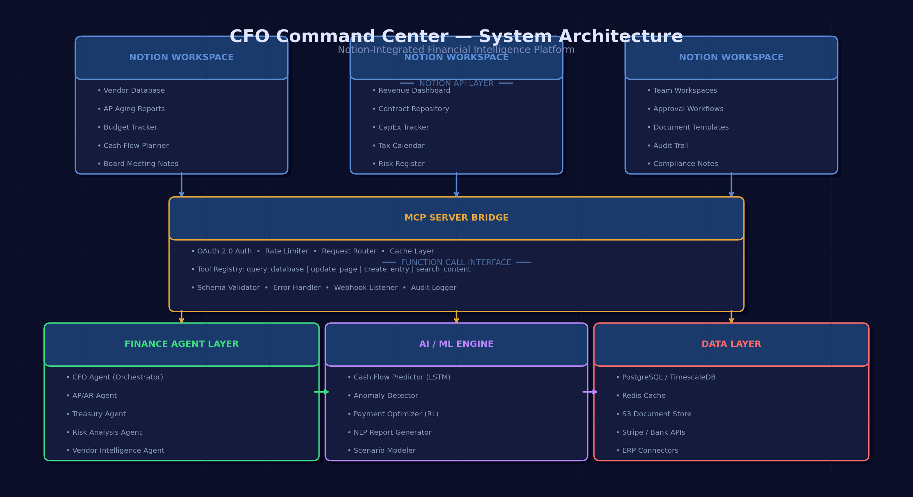
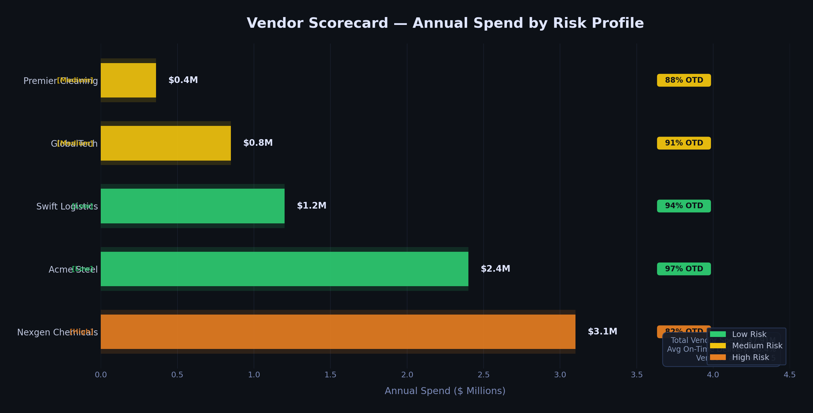
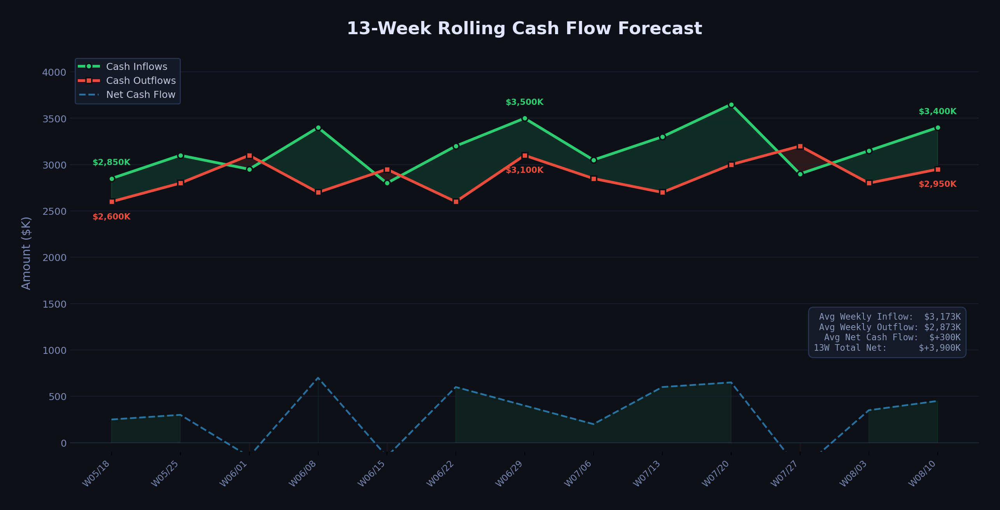
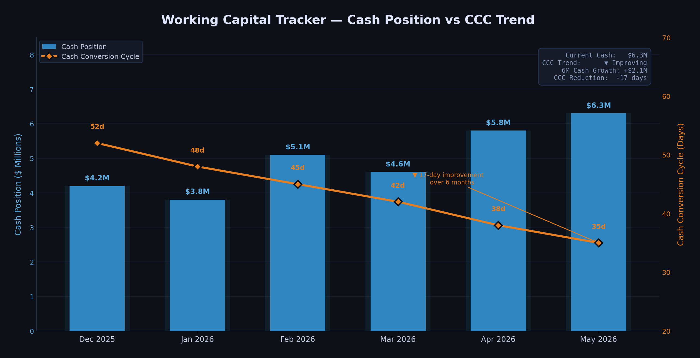
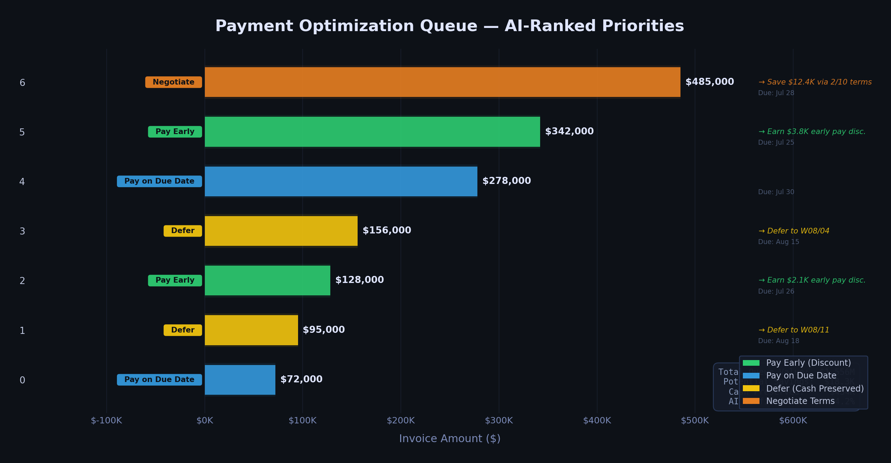

# CFO Command Center

> AI-Powered Finance Operations Hub — Built on Notion

<p align="center">
  
</p>

<p align="center">
  <strong>Real-time financial intelligence</strong> — vendor scoring, cash flow forecasting, working capital optimization, and payment prioritization, all inside your Notion workspace.
</p>

---

## What Is This?

CFO Command Center transforms your Notion workspace into a full-stack CFO operating system. It connects AI-driven finance agents to structured Notion databases, giving you real-time visibility into every critical financial metric — without leaving Notion.

**No standalone app. No browser tab. No copy-paste.** Your financial data lives where your team already works.

---

## Architecture

```
┌──────────────────────────────────────────────────┐
│                 Notion Workspace                  │
│  ┌────────────┐ ┌──────────┐ ┌───────────────┐  │
│  │  Vendor DB  │ │ CashFlow │ │  Working Cap  │  │
│  │  AP/AR DB   │ │ PayQueue │ │               │  │
│  └──────┬──────┘ └─────┬────┘ └──────┬────────┘  │
│         └──────────────┼─────────────┘           │
│               Notion MCP Server                   │
└───────────────────────┬──────────────────────────┘
                        │ MCP Protocol + REST API
┌───────────────────────┼──────────────────────────┐
│           Finance Agent Layer                     │
│  ┌──────────────────┐ ┌────────────────────┐     │
│  │ Working Capital  │ │ Cash Flow          │     │
│  │ Optimizer        │ │ Optimizer          │     │
│  └──────────────────┘ └────────────────────┘     │
│           Data Layer (CockroachDB / SQLite)       │
└──────────────────────────────────────────────────┘
```

---

## Databases

### 1. Vendor Scorecard
Track and score vendor performance across your entire supply chain.

<p align="center">
  
</p>

| Field | Type | Description |
|-------|------|-------------|
| Vendor Name | Title | Company name |
| Vendor ID | Text | Internal vendor code |
| Category | Select | Raw Materials, Services, Logistics, Technology, Utilities |
| Payment Terms | Select | Net 15 / Net 30 / Net 45 / Net 60 / Net 90 |
| Early Pay Discount | Select | 2/10 Net 30, 1/10 Net 30, None |
| Annual Spend | Dollar | Total annual vendor spend |
| Risk Rating | Select | Low / Medium / High / Critical |
| On-Time Delivery | Percent | Delivery reliability metric |
| Quality Score | Select | A (95-100) / B (85-94) / C (70-84) / D (Below 70) |
| Strategic Priority | Select | Tier 1 Strategic / Tier 2 Important / Tier 3 Commodity |
| Status | Select | Active / Under Review / On Notice / Terminated |

### 2. Cash Flow Forecast (13-Week Rolling)
Week-by-week rolling forecast with auto-calculated formulas.

<p align="center">
  
</p>

| Field | Type | Description |
|-------|------|-------------|
| Week | Title | Week range label |
| Opening Balance | Dollar | Week start cash position |
| Cash Inflows | Dollar | Total expected inflows |
| Cash Outflows | Dollar | Total expected outflows |
| Net Cash Flow | Formula | `Inflows - Outflows` (auto-calculated) |
| Closing Balance | Formula | `Opening + Net` (auto-calculated) |
| AR Collections | Dollar | Expected receivables collected |
| AP Payments | Dollar | Scheduled payables |
| Payroll | Dollar | Payroll obligations |
| CapEx | Dollar | Capital expenditure |
| Variance vs Forecast | Dollar | Actual vs. forecasted delta |
| Confidence Level | Select | High / Medium / Low |
| Week Status | Select | Actual / Forecast / Revised |

### 3. Working Capital Tracker
Monitor the health of your working capital cycle with trend analysis.

<p align="center">
  
</p>

| Field | Type | Description |
|-------|------|-------------|
| Period | Title | Month label |
| DSO | Number | Days Sales Outstanding |
| DPO | Number | Days Payable Outstanding |
| DIO | Number | Days Inventory Outstanding |
| CCC | Formula | `DSO + DIO - DPO` (auto-calculated) |
| Current Ratio | Number | Current assets / current liabilities |
| Quick Ratio | Number | (Current - Inventory) / Current |
| Net Working Capital | Dollar | Current assets - current liabilities |
| Cash Position | Dollar | Available cash on hand |
| CCC Trend | Select | Improving / Stable / Worsening |
| AI Recommendation | Text | Agent-generated optimization guidance |

### 4. AP/AR Aging
Accounts payable and receivable aging analysis with action items.

| Field | Type | Description |
|-------|------|-------------|
| Entry | Title | AP/AR entry identifier |
| Type | Select | Accounts Receivable / Accounts Payable |
| Entity | Text | Counterparty name |
| Invoice # | Text | Invoice reference |
| Invoice Date | Date | Invoice issue date |
| Due Date | Date | Payment due date |
| Original Amount | Dollar | Invoice face value |
| Outstanding Balance | Dollar | Remaining balance |
| Aging Bucket | Select | Current / 1-30 / 31-60 / 61-90 / 90+ Days |
| Priority | Select | Urgent / High / Normal / Low |
| Action Required | Text | Recommended next step |

### 5. Payment Optimization Queue
AI-ranked payment schedule to maximize discount capture and minimize borrowing costs.

<p align="center">
  
</p>

| Field | Type | Description |
|-------|------|-------------|
| Payment | Title | Vendor + amount identifier |
| Vendor | Text | Vendor name |
| Invoice Amount | Dollar | Payment amount |
| Due Date | Date | Net payment deadline |
| Early Pay Deadline | Date | Discount eligibility cutoff |
| Discount Available | Select | 2/10 Net 30 / 1/10 Net 30 / None |
| Discount Amount | Formula | `Amount * 2%` (auto-calculated) |
| Annualized Savings Rate | Percent | Annualized return on early payment |
| Borrowing Cost | Dollar | Cost to fund early payment |
| Net Benefit | Dollar | Discount minus borrowing cost |
| AI Recommendation | Select | Pay Early / Pay on Due / Defer / Negotiate |
| Priority Rank | Number | AI-assigned priority order |

---

## Key Metrics at a Glance

| Metric | Current Value | Trend |
|--------|:------------:|:-----:|
| Cash Position | $2.65M | Improving |
| Cash Conversion Cycle (CCC) | 22 days | Down from 35 (Dec) |
| Net Working Capital | $2.35M | Up 30% in 6 months |
| Vendor Discount Capture | $3,070 identified | Per payment cycle |
| AR Overdue | $491K (3 invoices) | Needs attention |
| AP Overdue | $102K (3 invoices) | Needs attention |

---

## Setup

### Prerequisites
- A [Notion](https://notion.so) workspace
- A [Notion Internal Integration](https://www.notion.so/my-integrations) with API token
- Python 3.10+ (for agent scripts)

### 1. Create a Notion Integration
1. Go to [notion.so/my-integrations](https://www.notion.so/my-integrations)
2. Click **New integration**
3. Give it a name (e.g., `CFO Command Center`)
4. Select your workspace
5. Under **Capabilities**, enable:
   - Read content
   - Insert content
   - Update content
6. Copy your `ntn_...` integration token

### 2. Connect to Your Page
1. Open the Notion page where you want the CFO Command Center
2. Click **•••** (top right) > **Connections** > **Add connections**
3. Search for and add your integration

### 3. Deploy the Databases
```bash
git clone https://github.com/<your-org>/cfo-command-center.git
cd cfo-command-center
cp .env.example .env
# Edit .env with your NOTION_TOKEN
pip install -r requirements.txt
python scripts/deploy_databases.py
python scripts/seed_sample_data.py
```

---

## Tech Stack

| Layer | Technology |
|-------|-----------|
| Workspace | [Notion](https://notion.so) |
| API Bridge | Notion MCP Server + REST API v2022-06-28 |
| Finance Agents | LangChain / CrewAI |
| Database | CockroachDB / SQLite |
| Language | Python 3.10+ / TypeScript |
| Deployment | GitHub Actions / Vercel Workers |

---

## Roadmap

- [x] **P0** — MCP Server configuration + connection testing
- [x] **P1** — Database schema design + sample data seeding
- [ ] **P2** — Finance Agent bidirectional data flow (MCP + REST)
- [ ] **P2** — Webhook event-driven updates
- [ ] **P3** — Notion built-in AI custom tools (Agent Tools API)
- [ ] **P3** — Serverless Workers for batch processing
- [ ] **P4** — Multi-entity support (consolidated reporting)
- [ ] **P4** — ERP integration (SAP, Oracle, NetSuite)

---

## License

MIT

---

<p align="center">
  Built with Notion API &bull; AI-Powered Finance Operations
</p>
